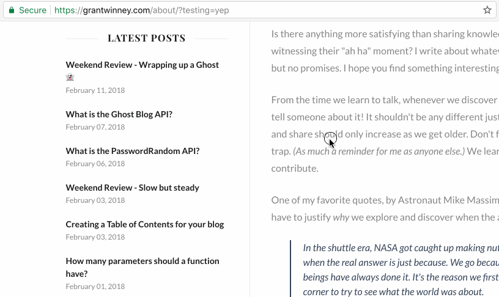

# Generate Links for Headers (a Chrome extension)

I frequently want to share a link with someone, but I want to link to a specific section of the page. That means checking out the source code for the page, finding the header element or an anchor nearby, and (if it has an ID assigned to it) appending it to the URL before sharing it.

I figured I can do better than that.

## Let's automatically create links for all headers

Here's an extension for Chrome, that scans the page and generates anchors for all headers on the page, *assuming they have an ID assigned.*

* Hover over the header, and the anchor link will appear.
* Click on the "chain" icon to copy the link to the clipboard.

**NOTE:** If there's no ID, then there's nothing to link *to,* and you won't see an anchor appear when hovering that header.

If you have any questions, comments, or issues, feel free to [create an issue](https://github.com/grantwinney/generate-links-for-headers-in-chrome/issues/new) and I'll check it out as my schedule permits.

Enjoy!
